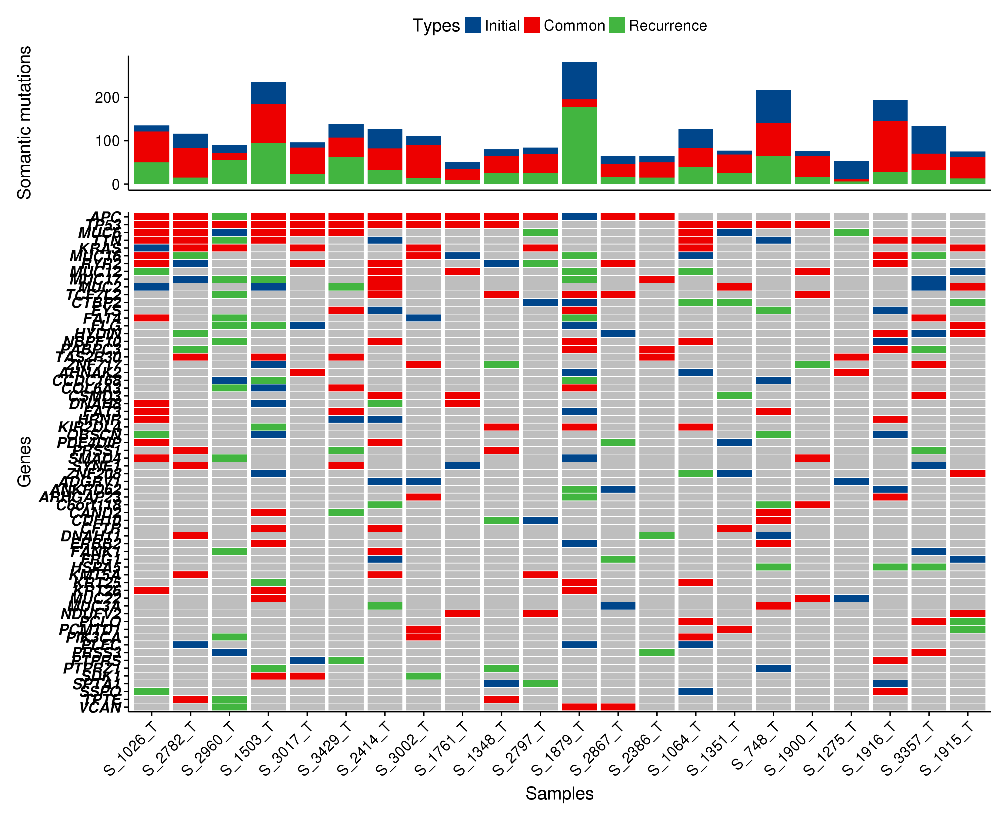

# RscriptCollection
 This repo collected the analysis scripts used in my daily research life. It's more like a treasure box of me since the every code i wrote will be recorded here.
 Currently, only a few scripts were presented on git and i will be happy to write the datail usage of each script to make it repproductive for others.

## Project structure

| Directory | Content |
| --------- | ------- |
| [images](images) | Hold images produced by scripts |
| [scriptsWithData](scriptsWithData) | Maintain scripts (and data if exists) |
 
## Gallary

### Cleavage plot

### Tumor VS Met plot

### Gene cumsum number plot

### Gene expression Box plot in TCGA pancancer 

### Indel ditribution plot based on Crispr cas9 PCR result 

### Forest plot 

### BarRatio Plot 

## How to contribute

Fork this repo, then add/modify contents according to the [structure](#project-structure).

For scripts with data, you should create a **new folder** then place them in. For single scripts, just live it alone.
